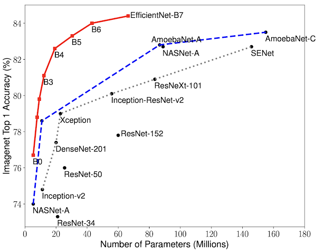

# **Is that A Melanoma ?**   

## ***Introduction***

Skin cancer is the most prevalent type of cancer. Melanoma, specifically, is responsible for 75% of skin cancer deaths, despite being the least common skin cancer. The American Cancer Society estimates over 100,000 new melanoma cases will be diagnosed in 2020. It's also expected that almost 7,000 people will die from the disease. As with other cancers, early and accurate detection—potentially aided by data science—can make treatment more effective.
This is a [kaggle competition](https://www.kaggle.com/c/siim-isic-melanoma-classification).

---
## ***Problem Statement***

    Identification of skin lesions as malignant(melanoma) or not.

---

## ***Approach***
---
### ***1. Summary of EDA***

So the data had image data and some meta data associated with the images. In total 33k images were for training and 10k images for testing purpose.

* So the data is **highly Imabalanced** . See in the plot below

As you can see there are over 30k images which are benign and less than 100 images which are malignant.

* Regions where most malignant images are found are ***Head/neck***.

* Finally here is a sunburst plot which summarizes everything.

The things I found out from the sunburst plot are as follows:

* Only 2% of our targets are malignant
* On malignant images males are dominant with 62%
* Gender wise benign images are more balance 52-48% male female ratio
* Malignant image scan locations differs based on the patients gender:
* Meanwhile the torso is most common location in males it's almost half of the scans meanwhile in females it's 39%
* Lower extremity is more common with female scans than males 18% males vs 26% females
* Again upper extremity malignant scans is common with females than males (23- 17%)
* Benign image scan locations more similar between male and female patients.

---

### ***2. Model And Training***

At first I began experimenting with resnet-34 and its variant but soon shifted to Efficient Nets.

*Reasons for selecting Efficient Nets*

* Computational Efficiency.
* Performance on Imagenet Task.

Below is graph showing the performance of efficient nets with other SOTA models

If you compare Efficient Net-b0 with resnet-34 efficient Net has very less parameters as compared to Resnet-34

Also I modified the head of efficient Net by adding a **Attention Layer** with **Avg pooling**. Below is the architecture

Both outputs from Attention Layer and Avg Pooling are concatenated first and then passed on to the FC. 

The **input Images** used are of size 384x384 with horizontal flips , vertical flip , rotation and Color Jitter as augmentations.

The **loss function** used is Focal Binary Cross entropy loss. The reason for using this loss is it penalizes the majority class more.

The model is trained for 15 epochs with *SGD* as the optimizer with *Cosine Annealing with warm restarts*. 
I have also used mixed precision while training to reduce my GPU usage.

The backbone I used is ***efficient Net-b0***

---

### ***3. Results***

The metric for the competition was roc auc score. My best model scored an auc roc of around 0.90. I didn't win a medal in this competition my rank was poor 874 out of 3314 teams.

---

## **Usage**

If you want to train your model I have provided all the necessary scripts needed. You just run 

    python trainer.py -h 

These arguments you will need to provide

    usage: trainer.py [-h] [-b BACKBONE] [-trainP TRAIN_PATH] [-e EPOCHS] [-bs BATCHSIZE] [-augs AUGMENTATIONS]
                    [-lr LEARNING_RATE]

    optional arguments:
    -h, --help            show this help message and exit
    -b BACKBONE, --backbone BACKBONE
                            Efficientnet model name
    -trainP TRAIN_PATH, --train_path TRAIN_PATH
                            Path to Training Images
    -e EPOCHS, --epochs EPOCHS
                            The Number of Training Epochs
    -bs BATCHSIZE, --batchsize BATCHSIZE
                            The Batch Size for dataloader
    -augs AUGMENTATIONS, --augmentations AUGMENTATIONS
                            Enter True for performing Augmentations or False if not needed
    -lr LEARNING_RATE, --learning_rate LEARNING_RATE
                            The value of learning rate

---

## ***Requirements***

* python 3.7
* PyTorch 1.6 
* Torchvision
* Efficientnet_pytorch (latest)
* Tqdm
* Numpy,Pandas,Seaborn,Plotly

---

## ***References***

* [Dataset](https://www.kaggle.com/cdeotte/jpeg-melanoma-384x384)
* [EfficientNet: Rethinking Model Scaling for Convolutional Neural Networks](https://arxiv.org/abs/1905.11946)
* [Mixed Precision Training](https://arxiv.org/abs/1710.03740)
* [EfficientNet Library](https://github.com/lukemelas/EfficientNet-PyTorch)

